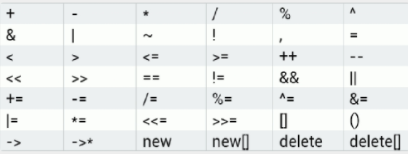

- [Operators](#operators)
- [Rule](#rule)
- [ooo](#ooo)
# Operators

This chart shows the operators that can be overloaded.



4 operators cannot be overloaded:

- `::`(scope resolution),
- `.`(member access),
- `.*`(member access through pointer to member),
- `?:`(ternary conditional)

# Rule

运算符函数的名称是以关键字`operator`为前缀的.

e.g. We need our `+` operator to return a new MyClass object with a member variable equal to the sum of the two objects' member variables.

```cpp
class MyClass {
public:
    int var;
    MyClass();
    MyClass(int a): var(a) {}
    MyClass operator+(MyClass &obj) {
        MyClass res;
        res.var= this->var + obj.var;
        return res;
    }
};
int main() {
    MyClass obj1(12), obj2(55);
    MyClass res = obj1 + obj2;
    cout << res.var;
    return 0;
}
```

# ooo

通过运算符重载，只能改变运算符原有的**操作数类型**(而不是优先级, 操作数个数).

成员函数是否:
- 有的运算符只能作为成员函数重载 (定义为非成员函数时, 会编译错误):
 
  赋值`=`, 下标`[]`, 调用`()`, 指针的成员访问`-＞`, 所有的类型转换运算符. 

- 有些运算符函数不能定义为类的成员函数，如I/O操作符

- 有的运算符可以作为非成员函数重载: 算术运算符、相等运算符


`++x`等效的运算符函数调用形式为`x.operator++()`