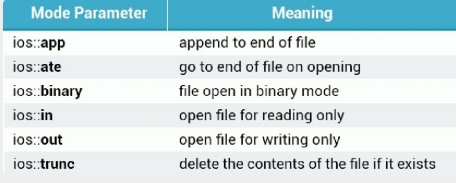

# Library

- `<ofstream>`: Output file stream that creates and writes information to files.
- `<ifstream>`: Input file stream that reads information from files.
- `<fstream>`: General file stream, with both `ofstream` and `ifstream` capabilities that allow it to create, read, and write information to files.

To perform file processing in C++, header files `<iostream>` and `<fstream>` must be includedin the C++ source file.

# Example

PS: `ofstream MyFile;`, the class name is still `ofstream` for write or `ifstream` for read, not `fstream`(it is the name of library, not the class)

```cpp
#include <iostream>
#include <fstream>
using namespace std;
int main()
{
    ofstream MyFile;
    if(MyFile.is_open()){
        MyFile.open("test.txt");
        MyFile << "Some text! \n";
    }else{
        cout << "open error!\n";
    }
    MyFile.close();
}
```

```cpp
#include <iostream>
#include <fstream>
using namespace std;
int main()
{
    ifstream MyFile("file/test.txt");
    string line;
    while(getline(MyFile, line)){
        cout << line << endl;
    }
    MyFile.close();
}
```

## constructor

constructor can replace `open()`

```cpp
ofstream MyFile("test.txt");
```

## file opening modes



```cpp
MyFile.open("file.txt", ios::out | ios:: trunc)
```
